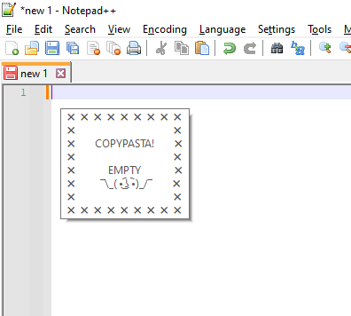
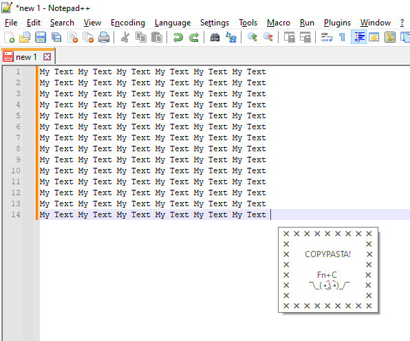
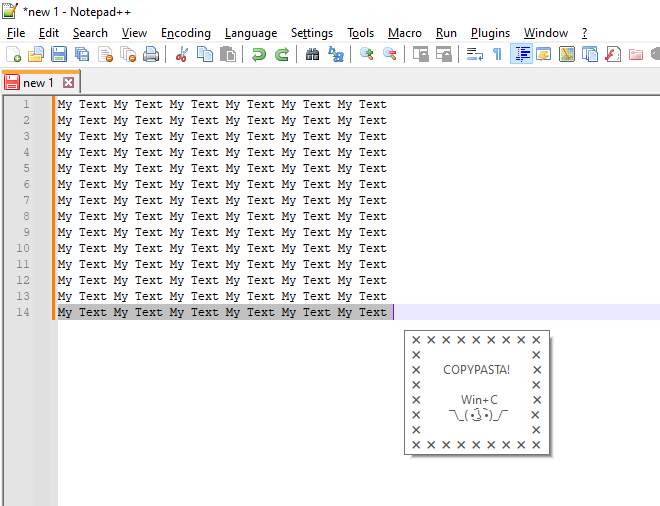
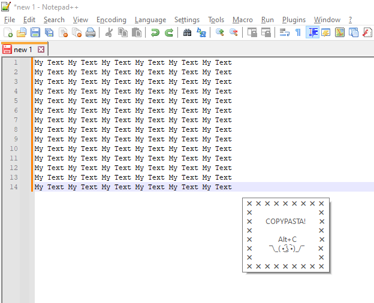
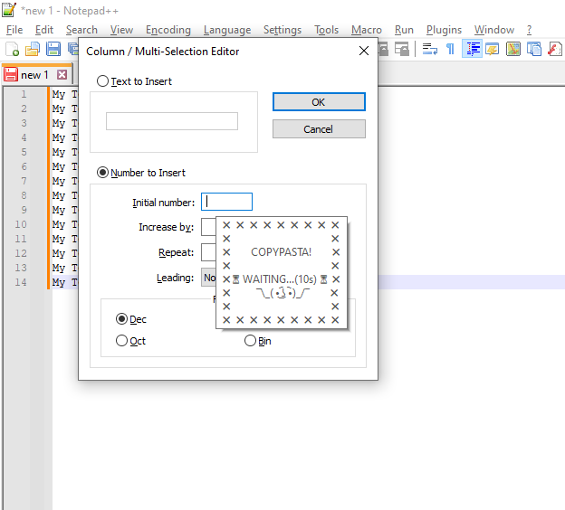
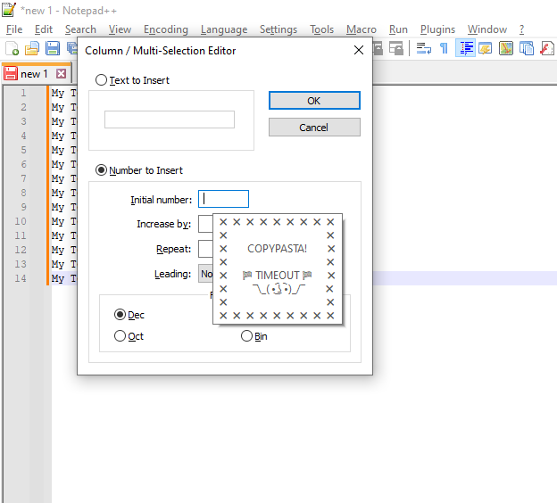

# Copy&Pasta
Informs about blank Copy&Pasta CTRL+C and prevents, by this, repeating the process of copying nothing in the clipboard

Basically just shows tooltip at caret or at mouse. Does not interrupt or change any thing.

#### Informs about sucessful Copy&Pasta CTRL+C
<table style="border: 0 !important;">
  <tr style="border: 0 !important;">
   <td style="border: 0 !important;">At caret with offset in editors</td>
   <td style="border: 0 !important;"></td>
  </tr>
  <tr style="border: 0 !important;">
   <td style="border: 0 !important;"></td>
   <td style="border: 0 !important;"></td>
  </tr>
 </table>
- informs about empty Copy&Pasta CTRL+C or A_Tab or up to 3 Space 
- informs about CRLF (Carriage Return/Line Feed) as an empty Copy&Pasta

- informs about wrong CTRL+C combinations such as LAlt+C or LWin+C

- When Copy&Pasta CTRL+C process take too long, there is a little information flow with timeout 

