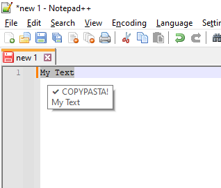
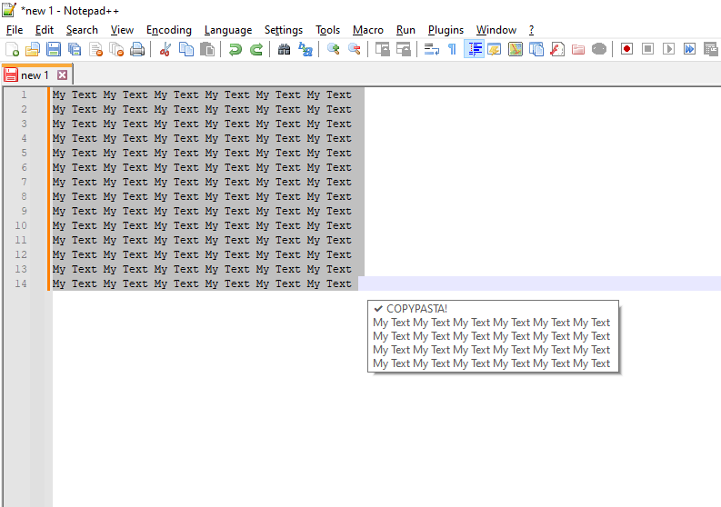

# Copy&Pasta
Informs about blank Copy&Pasta and prevents, by this, repeating the process of copying nothing in the clipboard

Basically just shows tooltip at caret or at mouse. Does not interrupt or change any thing.

Features:
- informs about sucessful Copy&Pasta CTRL+C

- informs about empty Copy&Pasta CTRL+C or A_Tab or up to 3 Space 
- informs about CRLF (Carriage Return/Line Feed) as an empty Copy&Pasta

- informs about wrong CTRL+C combinations such as LAlt+C or LWin+C

- When Copy&Pasta CTRL+C process take too long, there is a little information flow with timeout 

