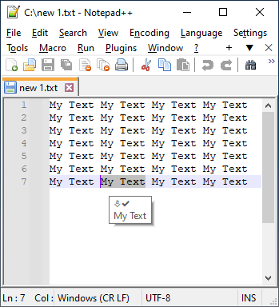
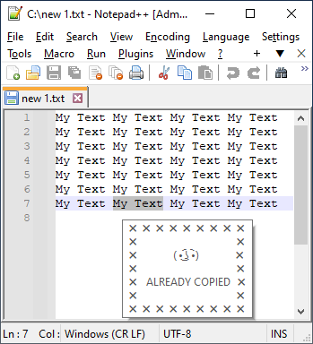
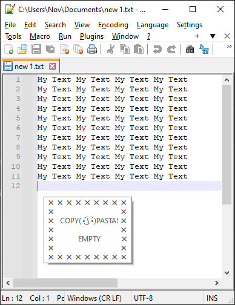
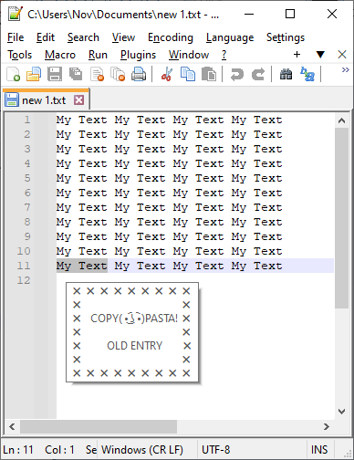
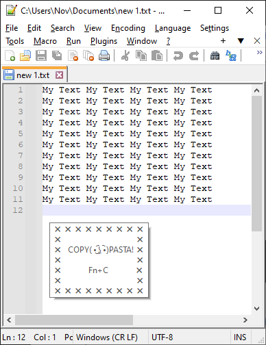
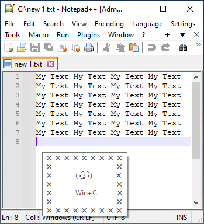
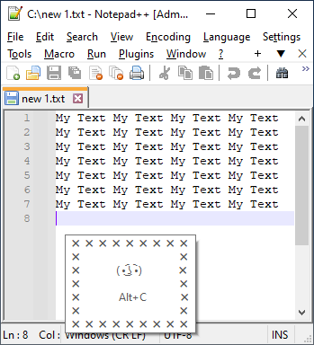
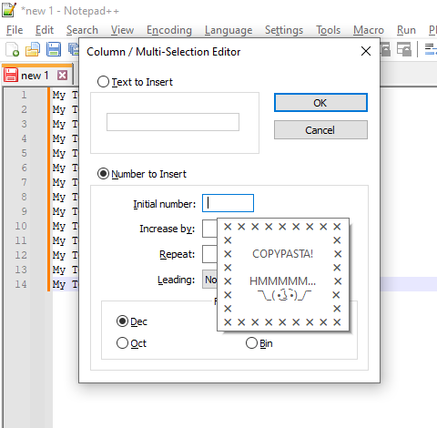

# Copy&Pasta
Informs about blank Copy&Pasta CTRL+C and prevents, by this, repeating the process of copying nothing in the clipboard

Basically just shows tooltip at caret or at mouse. Does not interrupt or change any thing.

#### Informs about sucessful Copy&Pasta CTRL+C
<table style="border: 0 !important;">
  <tr style="border: 0 !important;">
   <td style="border: 0 !important;">
At caret
</td>
   <td style="border: 0 !important;">
200 characters preview limit
</td>
  </tr>
  <tr style="border: 0 !important;">
   <td style="border: 0 !important;"></td>
   <td style="border: 0 !important;"></td>
  </tr>
 </table>
 
- #### Informs about empty Copy&Pasta CTRL+C
<table style="border: 0 !important;">
  <tr style="border: 0 !important;">
   <td style="border: 0 !important;">
NewLine CRLF (Carriage Return/Line Feed)
</td>
   <td style="border: 0 !important;">
Copy already exists in the current clipboard
</td>
  </tr>
  <tr style="border: 0 !important;">
   <td style="border: 0 !important;"></td>
   <td style="border: 0 !important;"></td>
  </tr>
 </table>
 

- #### Informs about unwanted combinations such as LAlt+C or LWin+C
<table style="border: 0 !important;">
  <tr style="border: 0 !important;">
   <td style="border: 0 !important;"></td>
   <td style="border: 0 !important;"></td>
   <td style="border: 0 !important;"></td>
  </tr>
 </table>
 
- #### When Copy&Pasta CTRL+C process takes too long, there is a little flow with timeout to prevent unexpected behaviour

