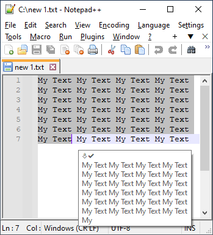
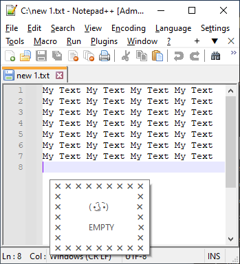

# Copy&Pasta
Informs about blank Copy&Pasta CTRL+C and prevents, by this, repeating the process of copying nothing in the clipboard

Basically just shows tooltip at caret or at mouse. Does not interrupt or change any thing.

#### Sucessful Copy&Pasta CTRL+C
<table style="border: 0 !important;">
  <tr style="border: 0 !important;">
   <td style="border: 0 !important;">
At caret, if avaiable
</td>
   <td style="border: 0 !important;">
200 characters set as a preview limit
</td>
  </tr>
  <tr style="border: 0 !important;">
   <td style="border: 0 !important;"></td>
   <td style="border: 0 !important;"></td>
  </tr>
 </table>
 
- #### Warnings for Copy&Pasta CTRL+C
<table style="border: 0 !important;">
  <tr style="border: 0 !important;">
   <td style="border: 0 !important;">
Copy is already in the clipboard (same copy)
</td>
   <td style="border: 0 !important;">
NewLine CRLF or empty
</td>
  </tr>
  <tr style="border: 0 !important;">
   <td style="border: 0 !important;"></td>
   <td style="border: 0 !important;"></td>
  </tr>
 </table>
 

- #### Unwanted combinations such as LAlt+C or LWin+C
<table style="border: 0 !important;">
  <tr style="border: 0 !important;">
   <td style="border: 0 !important;"></td>
   <td style="border: 0 !important;"></td>
   <td style="border: 0 !important;"></td>
  </tr>
 </table>
 
- #### When Copy&Pasta CTRL+C process takes too long, there is a little flow with timeout to prevent unexpected behaviour

